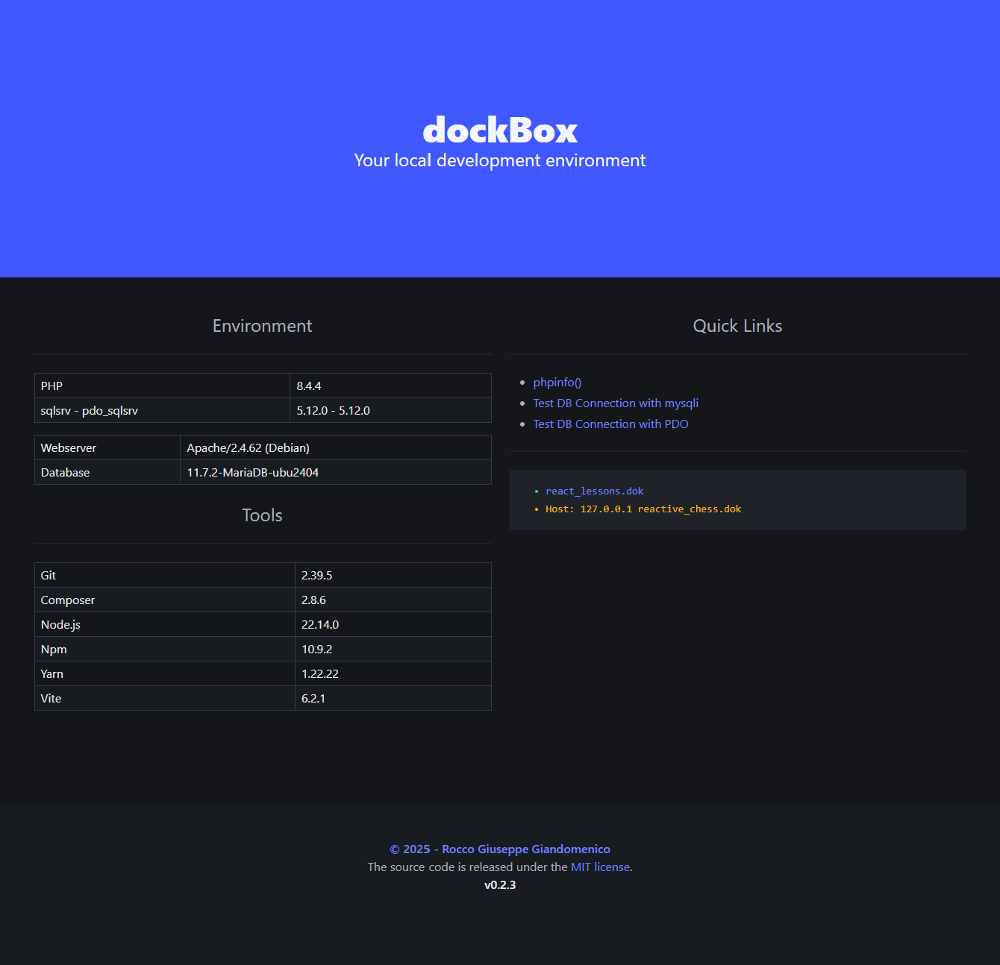

# dockBox
DockBox is a simple local development environment based on Docker, designed to facilitate web development across multiple platforms.

> PHP - Apache - MariaDB - sqlsrv/pdo_sqlsrv extensions

> Git - Composer - Node.js - Npm - Yarn - Vite

<!-- ----------------------------------------------------------------------- -->

## Installation
```bash
git clone https://github.com/rocco-giandomenico/dockBox.git
cd dockBox
cp sample.env .env
docker compose up -d
```
Go to dashboard -> http://localhost/

### Container Shell
```bash
docker compose exec --user dockbox webserver bash
```


<!-- ----------------------------------------------------------------------- -->

## Create Vue or React Apps
```bash
$ yarn create vite my-app --template vue
$ yarn create vite my-app --template react
```
### Development
```bash
cd my-app
yarn
yarn dev
```
```js
// -----------------------------------------------------------------------------
// vite.config.js
// -----------------------------------------------------------------------------

import { defineConfig } from 'vite'
import vue from '@vitejs/plugin-vue'

export default defineConfig({
  plugins: [vue()],
  server: {
    host: '0.0.0.0',
    port: 5173
  }
})
```
### Build
```conf

# ------------------------------------------------------------------------------
# default.conf
# ------------------------------------------------------------------------------

<VirtualHost *:80>
    ServerAlias *.${DOMAIN}
    DocumentRoot ${APACHE_SHARED_ROOT}/projects/my-app/dist

    <Directory ${APACHE_SHARED_ROOT}/projects/my-app/dist>
        Options Indexes FollowSymLinks
        AllowOverride All
        Require all granted
    </Directory>

    ErrorLog ${APACHE_LOG_DIR}/my-app_error.log
    CustomLog ${APACHE_LOG_DIR}/my-app_access.log combined
</VirtualHost>
```
```bash
yarn build
```


<!-- ----------------------------------------------------------------------- -->

## License

**[MIT License](https://github.com/rocco-giandomenico/dockBox?tab=MIT-1-ov-file)**
